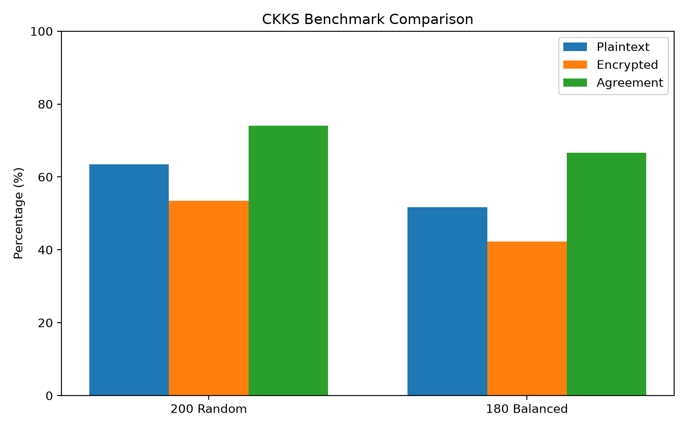

# Şifreli Tıbbi Görüntü Sınıflandırma

Bu proje, PathMNIST veri kümesi üzerinde tıbbi görüntü sınıflandırmasını homomorfik şifreleme kullanarak gerçekleştirmeyi amaçlamaktadır.

## Proje İçeriği

- PathMNIST veri kümesi analizi
- Normal CNN modelinin eğitilmesi
- Homomorfik şifrelemeye uygun doğrusal model geliştirilmesi
- CKKS ile şifreli çıkarım
- Açık metin ve şifreli çıkarım karşılaştırması
- Performans ve sayısal hata analizi

## Veri Kümesi

- Eğitim: 89.996 görüntü
- Doğrulama: 10.004 görüntü
- Test: 7.180 görüntü
- Toplam: 107.180 görüntü
- Görüntü boyutu: 28 x 28 RGB
- Sınıf sayısı: 9

## Normal CNN Sonuçları

Normal CNN modeli test kümesinde %83,94 doğruluk ve %77,05 Macro F1 elde etmiştir.

## Homomorfik Şifreleme

Şifreli çıkarım için TenSEAL kütüphanesi ve CKKS şifreleme yöntemi kullanılmıştır.

CKKS ayarları:

- Polynomial modulus degree: 8192
- Coefficient modulus sizes: [60, 40, 40, 60]
- Global scale: 2^40

## HE Uyumlu Model

Final model 16 x 16 RGB görüntüler üzerinde çalışan doğrusal bir sınıflandırıcıdır.

Model yapısı:

16 x 16 x 3 -> Flatten -> Linear 768 -> 64 -> Linear 64 -> 9

Polynomial aktivasyonlar da denenmiş, ancak CKKS ölçek ve multiplicative-depth problemleri nedeniyle final modelde kullanılmamıştır.

## HE Model Sonuçları

Tam test kümesinde:

- Accuracy: %57,13
- Macro F1: %43,86

## Şifreli Çıkarım Benchmarkları

CKKS ile gerçek şifreli çıkarım, TenSEAL 0.3.17 kullanılarak gerçekleştirilmiştir.

### 200 Örnek Random Benchmark

Test kümesinin ilk 200 örneği üzerinde benchmark:

| Ölçüm | Sonuç |
|---|---:|
| Örnek sayısı | 200 |
| Plaintext accuracy | **63.50%** |
| Encrypted accuracy | **53.50%** |
| Prediction agreement | **74.00%** |
| Ortalama maksimum CKKS hatası | **2.200091** |
| Ortalama mutlak hata | **0.768770** |
| En kötü maksimum hata | **2.200113** |
| Ortalama şifreleme süresi | **4.52 ms** |
| Ortalama şifreli çıkarım | **1229.00 ms** |
| Ortalama toplam HE süresi | **1233.52 ms** |

### 180 Örnek Dengeli Benchmark

Her sınıftan 20 örnek seçilerek toplam 180 örnek üzerinde sınıf dengeli benchmark:

| Ölçüm | Sonuç |
|---|---:|
| Örnek sayısı | 180 |
| Sınıf başına örnek | 20 |
| Plaintext accuracy | **51.67%** |
| Encrypted accuracy | **42.22%** |
| Prediction agreement | **66.67%** |
| Ortalama maksimum CKKS hatası | **2.200092** |
| Ortalama mutlak hata | **0.768771** |
| En kötü maksimum hata | **2.200113** |
| Ortalama şifreleme süresi | **4.48 ms** |
| Ortalama şifreli çıkarım | **1222.87 ms** |
| Ortalama toplam HE süresi | **1227.34 ms** |

### Benchmark Karşılaştırması

Random benchmark ile dengeli benchmark arasındaki fark, örnek dağılımının sonuçlar üzerindeki etkisini göstermektedir. Dengeli benchmark sınıfların eşit temsil edilmesini sağladığı için sınıflar arası karşılaştırma açısından daha kontrollü bir deneydir.

> Benchmark doğrulukları, modelin tam test kümesi doğruluğu olarak yorumlanmamalıdır. Modelin gerçek test performansı 7.180 örnekten oluşan tam test değerlendirmesinde raporlanmıştır.

## Proje Yapısı

README.md
.gitignore
requirements.txt
train_model.py
evaluate_model.py
train_he_linear.py
evaluate_he_linear_test.py
encrypted_linear_inference.py
benchmark_encrypted.py
benchmark_encrypted_200.py
benchmark_encrypted_balanced_180.py
compare_benchmarks.py
test_ckks.py
test_encrypted_matmul.py
check_dataset_leakage.py
explore_dataset.py
plot_final_results.py

experiments/ klasörü başarısız ve deneysel HE çalışmalarını içermektedir.

## Kurulum

python3 -m venv .venv
source .venv/bin/activate
pip install -r requirements.txt

## Sınırlamalar

- HE modeli normal CNN modelinden daha düşük doğruluğa sahiptir.
- Şifreli benchmarklar 200 örnekli random ve 180 örnekli sınıf-dengeli deneyler içermektedir.
- CKKS yaklaşık aritmetik kullanmaktadır.
- Şifreli çıkarım normal çıkarımdan çok daha yavaştır.
- Final HE modeli doğrusal işlemlerden oluşmaktadır.

## Sonuç

Proje, tıbbi görüntü sınıflandırmasında homomorfik şifreleme kullanımını deneysel olarak göstermektedir. Sonuçlar doğruluk, gizlilik, sayısal kararlılık ve hesaplama maliyeti arasında önemli bir denge bulunduğunu göstermektedir.
